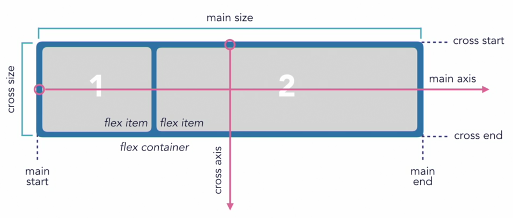

# FlexBox


[FlexBox from CSS Essential Training](https://www.linkedin.com/learning/css-essential-training-3/introduction-to-flexbox?u=41913900)


## Overview

* 1 Dimensional Layout
* Features designed for a responsive and flexible content
* Can be used for page layout, but is intended for - content - in the layout
* Different properties for flex-container vs. Parent
* Future syntax may be added/modified/removed
* [Parent \(container\) Properties](https://codepen.io/manikoth/pen/eZQwQO?editors=1100)
* [Child \(items\) Properties](https://codepen.io/manikoth/pen/aNQevB?editors=0110)
* [Direction](https://codepen.io/manikoth/pen/VaqGWr)
* [Justify Content](https://codepen.io/manikoth/pen/grZBrN)

